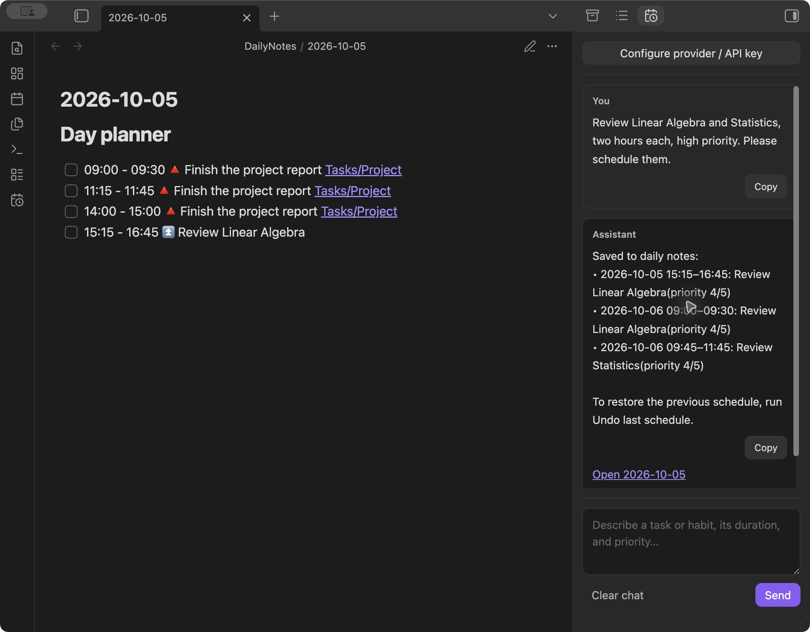
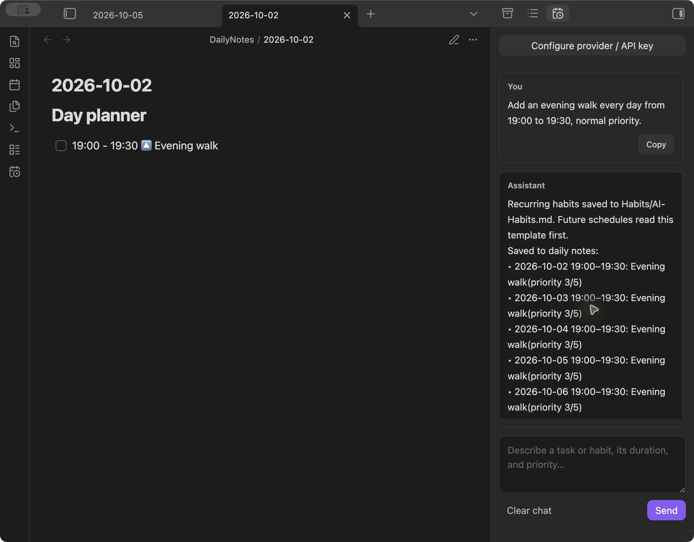
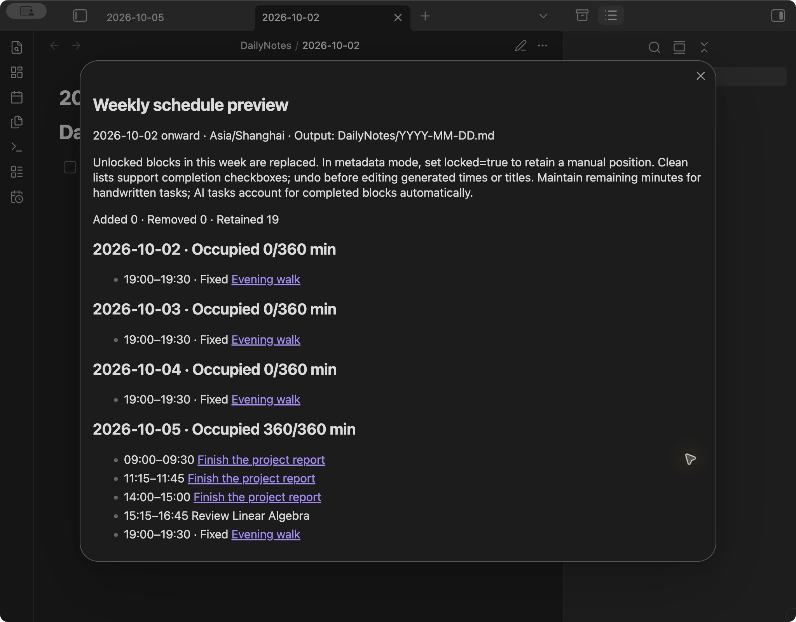
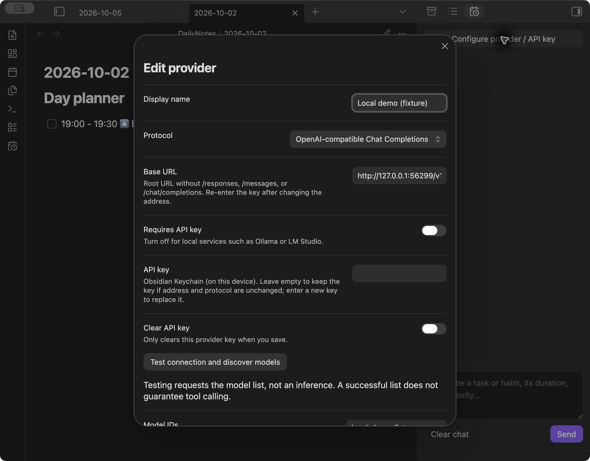

# Auto Scheduler

Turn tasks and recurring habits into a seven-day plan in your Obsidian daily notes.

Describe what you need to do, give an estimated duration, and let the local scheduler find time around your events, habits, and daily capacity. Use the optional AI assistant with your own provider, or schedule Markdown tasks entirely offline.



## What it does

- **Chat to schedule.** Create tasks, exact one-off events, or fixed-time recurring habits. The reply lists actual saved times and opens the corresponding daily note.
- **Plan locally.** Priority, deadlines, working hours, fixed events, buffers, and daily capacity determine the schedule. A model cannot choose file paths or overwrite arbitrary notes.
- **Read and revise plans.** Ask about a dated plan, move unfinished work to tomorrow, or change a task title/priority. Completed records and recurring habits remain intact; one undo restores the entire revision.
- **Keep readable notes.** Time-based checkboxes appear under `# Day planner` in `YYYY-MM-DD.md`, without hidden management comments in clean daily mode.
- **Reserve habits first.** Daily, weekday, weekend, or selected-day habits can also occur outside working hours.
- **Preview and undo.** Manual scheduling previews file changes. AI actions apply directly after validation. The last operation can be undone across a plugin restart.
- **Bring your own model.** OpenAI Responses, OpenAI-compatible Chat Completions (including DeepSeek), Anthropic Messages, and Google Gemini; local Ollama and LM Studio endpoints are supported when the model implements tool calling.

Desktop only; minimum Obsidian version **1.6.6**. The interface and documentation default to English. AI conversations can use your own language; existing Chinese habit templates remain supported.

## Installation

The project is preparing its first community-directory submission; it is **not yet listed** in Obsidian's Community plugins browser.

For now, build from source or install the three plugin files from a published [GitHub release](https://github.com/determinedsceptic/obsidian-auto-scheduler/releases) when available:

1. Create `<vault>/.obsidian/plugins/auto-scheduler/`.
2. Put `main.js`, `manifest.json`, and `styles.css` in that folder.
3. Reload Obsidian and enable **Auto Scheduler** under **Settings → Community plugins**.
4. Try it in a separate vault before using existing notes. Back up plugin data along with your notes.

Do not install GitHub's source-code ZIP as a plugin; it does not contain the built `main.js`.

## Quick start

1. Click the calendar-clock ribbon icon, or run **Auto Scheduler: Open AI assistant**.
2. In **Settings → Community plugins → Auto Scheduler**, choose **Add provider**. Select its endpoint and a tool-capable model, then enter your own key if required. Provider models load automatically when you open the assistant or edit a saved provider; a newly entered key loads its list when you leave the key field. Choose from the list, or use **Refresh models** in the sidebar / **Refresh model list** in configuration to refresh it. Manual IDs are an optional advanced fallback. The sidebar's **Configure provider / API key** button edits the active provider.

3. Try: **“Review two courses, two hours each, high priority. Please schedule them.”**
4. Use the **Model** selector above the conversation to switch between saved providers and models. Read the assistant's saved time slots. The first scheduled daily note opens automatically; links in the answer open other dates.
5. Replan with **Preview weekly schedule**. Use **Undo last schedule** to restore the last write.

For DeepSeek, choose **Add provider → DeepSeek** in plugin settings. It fills the official API address and offers `deepseek-flash` and `deepseek-v4-pro`; enter a DeepSeek API key and choose **Model for chat** before saving. You can switch models later in the sidebar, discover more models, or enter model IDs manually. See [DeepSeek's API documentation](https://api-docs.deepseek.com/quick_start/pricing/).

The OpenAI template offers `gpt-6-luna` and `gpt-6-sol` for the same API key. Available models depend on the provider account; use model discovery or edit the IDs if your account offers a different set.

For offline scheduling, configure **Output location → Daily notes: Day planner**, **Output format → Day Planner**, and **Clean daily lists**, then add estimated tasks in `Tasks/`:

```markdown
- [ ] Prepare a report <!-- as id=report remaining=120 priority=4 split=true min=30 -->
- [ ] Review the slides <!-- as id=slides remaining=45 priority=3 split=false -->
```

Run **Preview weekly schedule**, inspect the result, then select **Apply schedule**. Ordinary tasks without explicit IDs and estimates are left alone.

A start-only request such as **“Exercise tomorrow at 19:00”** reserves **19:00–19:30** by default. Change **Default duration (minutes)** in plugin settings. The answer reports that assumption; an explicit duration takes precedence. Flexible tasks without an estimate also use this default and report the assumption. An undated appointment uses the next occurrence of its start time. Mixed requests schedule every kind in one operation. Handwritten start-only daily rows and habit templates use the same setting. Conflicts or cross-midnight ranges require a correction. See [usage](docs/usage.md#events-with-only-a-start-time).

## Examples

Screenshots below are real Obsidian captures using synthetic notes and a deterministic localhost API fixture. They demonstrate the actual plugin interface and scheduler; **no paid model was called**. See [reproduce the examples](examples/README.md).

### 1. A study plan that fits around events

Prompt: “Review Linear Algebra and Statistics, two hours each, high priority.” The host schedules the work, reports actual times, and opens the day containing the first block.


### 2. Habits that repeat without clutter

Prompt: “Every day, walk from 19:00 to 19:30, normal priority.” The host saves a readable habit template and creates independent occurrences for the next seven days.



You can also edit `Habits/Template.md` directly:

```markdown
- 19:00-19:30 Evening walk (every day)
- 07:30-08:00 ⏫ Exercise (Mon, Wed, Fri)
- 22:00-22:15 🔽 Read a book (weekends)
```

No recurrence suffix means every day. Default template examples are inside a code fence and inactive; copy a line outside the fence to enable it. No IDs or HTML comments are needed. Habit names and source paths identify occurrences; keep them unchanged when editing times if you want to preserve completion associations.

### 3. A preview before changing a busy week

Manual preview shows daily occupied capacity, additions and removals, errors, and remaining unscheduled work. A full day does not cause work to overlap events or silently disappear.



### 4. A provider you control

Use hosted APIs or a compatible local service. Changing the endpoint or protocol requires a new key; saved keys are never silently forwarded to a different endpoint.



## Commands

| Command | Purpose |
| --- | --- |
| Open AI assistant | Open the chat sidebar. |
| Create habits template | Create and open an example template without replacing an existing one. |
| Preview weekly schedule | Preview today plus six days, then apply manually. |
| Clean daily schedule format | Remove legacy display metadata from existing tracked daily output without replanning. |
| Undo last schedule | Restore the latest template and schedule write, if the files are unchanged. |

## Privacy, payments, and accounts

**Local scheduling needs no account, API key, or network connection.** Optional AI chat requires a provider that supports tool calling; hosted providers may require an account and charge API fees independently of this plugin. An existing ChatGPT or Codex subscription does not itself provide an API key.

The plugin sends chat messages, local date/time, scheduling constraints, the bundled habits skill, and configured **vault-relative** habit/daily-note paths to your selected endpoint. When the assistant calls `read_daily_plan`, it sends checkbox task summaries from the requested date’s `Day planner` section to that provider (title, completion, duration, deadline, priority and edit reference). The explicitly named habits section (Habits and guidelines / 习惯与计划) may also be included for habit inheritance. The `read_habits` tool sends parsed fixed-time habits and guideline lists from every Markdown template in the configured habits folder, including their vault-relative filenames. Unrelated sections and absolute filesystem paths stay local. Existing plans are not included automatically in every chat request. Opening the assistant or editing a saved provider automatically queries that same provider's `/models` endpoint; entering a new key triggers discovery after leaving the field. Manual refresh is also available. These requests load model metadata and do not generate text. Your provider's own retention and billing policies apply.

There is no plugin telemetry, advertising, remote code execution, automatic self-update, or access to files outside the vault. Keys are stored in the host's **Obsidian Keychain** when its public API is available; otherwise keys stay in memory until reload. Keys are not written to Markdown, plugin `data.json`, logs, or Git. Chat history is in memory and clears when the panel closes.

Read [privacy and recovery](docs/privacy.md) before using AI with private text.

## Scheduling rules and limits

- The plan covers the current local day plus six days. New ordinary work starts in the future; habits record their confirmed fixed time, including an elapsed time today.
- Flexible tasks, working hours and one-off events use a **15-minute grid**. Recurring habits support exact minutes (for example, 12:40 after a 10-minute rest), ordinary parentheses in titles, and adjacent activity sequences. Habits must fit within one day; an end at `24:00` is supported.
- Ordinary tasks are allocated by priority, then deadline, earliest start, and stable ID. The greedy schedule is deterministic, not globally optimal; some work may remain unscheduled.
- Events and habits reserve time before ordinary work. Buffers count toward capacity within working hours. Habit conflicts reject the write rather than move a fixed activity.
- No monthly/yearly habits, overnight intervals, external calendar sync, ICS import, or background monitoring of other plugins' newly created notes.
- Weeks containing a local daylight-saving transition are rejected. Mobile is not supported; native UI validation currently covers macOS. Windows/Linux host UI validation remains open.
- Clean lists support completion checkboxes and edits outside the generated region. Editing generated titles or times can invalidate tracking; undo before changing them.
- Multi-file writes are not atomic. A durable backup is saved first, and partial writes can be recovered with undo. Only the most recent operation is retained.

For task fields, settings, fixed events, and calendar formats, see [usage](docs/usage.md) and [compatibility](docs/compatibility.md).

## Development

Node **22 or 24** and npm are recommended. The lockfile and `.npmrc` fix dependency resolution.

```sh
npm ci --ignore-scripts
npm run typecheck
npm test
npm run smoke
npm run release:check
npm run package
```

The three installation files are generated in `dist/auto-scheduler/`. `npm run dev` rebuilds on source changes. It does not install the plugin or launch Obsidian.

See [CONTRIBUTING.md](CONTRIBUTING.md), [architecture](docs/architecture.md), and [release preparation](docs/releasing.md). Historical design decisions and validation records remain in [docs/development](docs/development/README.md).

## License and acknowledgements

[MIT](LICENSE), copyright 2026 Alex Hu. This is an independent community project, not an official Obsidian product.

[Day Planner](https://github.com/ivan-lednev/obsidian-day-planner) and [Gantt Calendar](https://github.com/sustcsugar/obsidian-gantt-calendar) informed the Markdown interoperability design. [Copilot](https://github.com/logancyang/obsidian-copilot) informed the provider-configuration workflow. Their implementations are not bundled or vendored. See [acknowledgements](docs/acknowledgements.md).

## Read and carry over existing work

Try: “Read today’s plan. Move unfinished ordinary tasks to tomorrow, keep completed records, and continue long-term work over the following days.” Or: “In tomorrow’s plan, raise Review to priority 4.”

The assistant reads `YYYY-MM-DD.md` under the configured daily-note folder before requesting changes. It can read the past 30 days and the next seven local dates. The host moves selected unfinished tasks, preserves existing AI task IDs and completed effort, and schedules from the target date within its seven-day window. Plain handwritten checkbox tasks can be imported with the configured default duration; explicit time ranges preserve their duration. Reports list actual saved slots, defaults, and work that remains unscheduled. The first destination note opens automatically. Run **Undo last schedule** to restore both notes and task state.

Completed tasks, recurring habits, locked blocks, source-managed task rows, nested items, and rows with links are protected from chat edits. Existing AI tasks preserve their total effort and deadlines; their duration cannot currently be edited through chat. Edit the original source/template for those protected cases.

Plain handwritten Tasks/Dataview date and priority fields are accepted on carry-over. Their deadlines and earliest-start constraints are retained; moving beyond the existing deadline is rejected. Management comments and source links remain protected.

## Natural-language habits and visible deadlines

A deadline-only task uses **Default duration** while retaining its original deadline. Clean daily rows show `📅 YYYY-MM-DD` (and a time when applicable); chat reads and saved-slot reports also include that deadline. Carry-over never replaces the deadline with the new scheduled date.

Try: “Save these habits: walk 30 minutes after lunch and dinner, resting 10–20 minutes first; do strength training on Monday, Wednesday and Friday after the evening walk; keep my dietary rules as written.” The assistant decomposes the routine into separate actions and non-time rules, then stores each distinct habit in a separate Markdown file named after its specific title in the configured habits folder. Generated daily schedule notes contain timed blocks, not repeated source prose. Relative routines and conditional rules remain guidelines until you confirm their clock times and a rest duration; strength training uses the configured default duration when none is given. the assistant asks for meal/anchor times to create timed blocks. It lists the decomposed actions and marks missing times for confirmation; it does not invent meal times. Whole-plan inheritance can save the action list and move tasks in one undoable action. Existing habit sections are preserved; an absent section is created as **Habits and guidelines**.

Confirmed habit anchors are persisted as fixed time rows in the individual habit file, not just relative descriptions. The `save_habit_guidelines` document schema includes `schedule` (start, end, weekdays, priority); a null end applies Default duration. Null schedule is reserved for non-time constraints or genuinely unknown anchors. Later reads use the stored start/end directly.

### Habit reuse and effort estimates

Before creating a routine, the assistant reads all habit templates and reuses the canonical title for an equivalent activity. Identical timed routines are idempotent; conflicting times and ambiguous existing duplicates are rejected for clarification. Lunch and dinner walks remain separate. Descriptive rules are merged into the existing document rather than generating a file per sentence.

For projects such as reading a book, the assistant estimates total effort before scheduling and reports its calculation and assumptions. For example, a provisional 300-page book at 30 pages/hour requires 600 minutes, split across available days. This is an adjustable estimate, not a confirmed fact about your book. Short atomic errands can still use the configured default duration.

### Calendar interoperability

Liam Cain's Calendar needs the core Daily Notes folder set to `DailyNotes` and format `YYYY-MM-DD`; enable Calendar under Community plugins. Calendar opens dated notes; Gantt Calendar requires explicit date fields to display task intervals.

Clean daily output is a concise Day Planner list, for example `- [ ] 12:40 - 13:10 🔼 Lunch walk`. Only genuine task deadlines use `📅`; a habit's fixed end is not a deadline. Calendar opens these notes by their filename. Gantt Calendar does not natively infer precise intervals from a bare Day Planner clock range; full Gantt date fields require opting into Gantt output with Clean daily lists disabled for manual scheduling. Compact daily notes do not append duplicate start/end metadata merely to populate the Gantt view.
