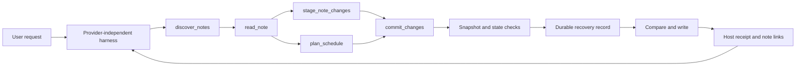

# Architecture

Auto Scheduler is a TypeScript Obsidian plugin bundled as CommonJS with esbuild. The installed plugin imports only Obsidian APIs; Node.js is used by build and test scripts.

The generic harness described in [the accepted refactor](development/harness-refactor.md) is the active chat architecture.

## Responsibilities

| Module | Responsibility |
| --- | --- |
| `main.ts` | Plugin lifecycle, commands, settings, active-note scope, vault adapter, durable state, and serialized operations. |
| `chat-view.ts`, `provider-modal.ts` | Sidebar conversation, host result display, note links, and BYOK configuration. |
| `agent-harness.ts`, `agent-protocol.ts` | Provider-independent tool loop, protocol encoding, bounded execution, and tool-result feedback. |
| `plugin-agent.ts`, `runtime-skills.ts` | Per-send scope/context, runtime skill loading, generic tools, and scheduling registration. |
| `note-workspace.ts`, `markdown-structure.ts` | Discovery, version-bound document/section/block references, staged Markdown edits, commit receipts, and undo. |
| `schedule-adapter.ts`, `task-sources.ts` | Explicit `plan_schedule` and `bind_task_source`, persistent source identity/protection, custom habit sources, Day planner-only rendering, and schedule staging. |
| `transaction.ts`, `queue.ts` | Scheduler snapshots, rendering state, legacy apply/undo compatibility, and serialization. |
| `parser.ts`, `habits.ts`, `event-tool.ts`, `calendar-priority.ts` | Compatibility task metadata, preferred habit occurrences, exact events with persistent buffers, and declared calendar certainty. |
| `scheduler.ts`, `time.ts` | Deterministic seven-day allocation and local time/capacity constraints. |
| `daily.ts`, `output.ts`, `tracking.ts`, `event-tracking.ts` | Day planner parsing/rendering, managed-region diffs, clean-list tracking, and hidden per-event buffer records. |
| `providers.ts`, `credentials.ts`, `llm-request.ts` | Provider templates, model discovery, transport, retry feedback, and isolated credentials. |

Legacy specialized schemas remain for manual/offline scheduling and migration. They are not the active chat dispatcher.

## Tool execution

Every tool result is returned to the model, including validation failures, conflicts, partial writes, and successful receipts. A committed receipt is stored and displayed independently of subsequent model output, so a provider error after commit cannot erase or rewrite the operation status.

The model may stage several generic edits before commit. `plan_schedule` can consume a staged change set through an overlay vault, schedule against the proposed bytes, and create a combined change set. The final commit uses original read snapshots as dependencies and writes the union of ordinary note edits and final Day planner bytes. One receipt and one undo record cover the composition.

## Scope and references

Each send creates a fresh `NoteWorkspace`. Its default scope contains the currently open Markdown file and valid dated notes in the configured daily folder. Settings may add explicit note folders. Skills and note contents cannot enlarge that scope.

Discovery returns paths and document references. Reading binds document, section, and block references to exact source bytes. Stage and commit reject stale or superseded references. Arbitrary headings remain ordinary data; the workspace does not assign business meaning to `Tasks`, `Research`, `待办`, or another title.

Provider-visible reads and trusted scheduler dependencies are separate. The scheduler may locally snapshot configured inputs needed for conflict safety without exposing their contents through the tool result.

## Scheduling boundary

Ordinary Markdown edits never call the scheduler. `plan_schedule` is the only active-chat scheduling entry and always uses dated Day planner output with layout preservation. It does not create a Tasks master, move source checkboxes, or write habit templates.

New tasks bind to previously read untimed checkbox blocks outside Day planner, within the saved-source size budget. They keep the user's chosen heading and source wording. Internal IDs and occurrence/count bindings distinguish identical source rows. `read_note(changeSetRef)` exposes exact staged blocks so new sources and sessions can commit atomically. `bind_task_source` composes an explicit rename/rebind with note edits while preserving the task ID and progress. Open legacy tasks without a source must be bound before active-chat replanning. Custom habit references are normalized only for the preview; their source notes are dependencies, not scheduler outputs. Active chat does not scan the configured task or habit folders implicitly.

Source checkboxes determine completion or cancellation. Session blocks and duration estimates cannot remove or complete an open source. The prepare hook distinguishes generic edits from trusted scheduling changes. Generic edits update exact source bindings, preserve uniquely verified moves, or mark changed/missing bindings `sourceDetached` without rejecting the edit. Task history survives; detached goals receive no new allocation until explicitly rebound. Existing detached sessions remain preferred soft blocks and may yield to hard events; completed and explicitly locked history stays protected. Scheduling revalidates conservation of every still-bound source. Deleted terminal sources become retired records with retained history and cleared active bindings; a later identical task gets a separate identity. Unknown effort is represented with a null total and a separately agreed session budget and daily pace. Known estimates exhausted while the source remains open produce `needsReview`, not completion.

Session paths and checked block IDs retain effort history across planning horizons independently of clean-list tracking. Explicitly unchecked observed sessions reverse their own progress entry; absent historical sessions retain recorded progress. The tool result separates persistent goals, session blocks, pending budget, and unknown total effort. Source status edits become task-state changes in the same transaction; existing calendar sessions are refreshed by the next explicit schedule plan.

The adapter stages preview outputs and proposed tracking/task state through `NoteWorkspace`. It returns actual blocks, unscheduled work, and per-day capacity. Before commit, an ephemeral validator rechecks the local date, time zone, exact-event starts, and new unlocked block starts.

In clean-list mode, fixed-event rows keep only their actual times and title. `TrackingPair.eventRecords` retains optional annotated rows and resolved buffers. Reconciliation restores metadata only for unique unchanged rows, with their current checkbox/completion state. Changed, missing, ambiguous or differently annotated rows discard obsolete hints; a modified generated span becomes handwritten content instead of restoring old bytes. Rehydration never locks a note. Generic commits journal pruning alongside the requested edit; scheduling keeps its original state baseline for conflict checks and a separate reconciled next state. Only event rows that still match current note contents enter model context. Both scheduling commit paths and undo retain complete state snapshots.

Post-write dependency drift or an unverifiable read returns a durable partial operation. Further commits stay locked until recovery; undo restores owned files and state without overwriting concurrently changed dependencies.

Manual scheduling follows the older configured task/habit/fixed-source pipeline and supports single-file, daily, Day Planner, Tasks/Dataview, and Gantt compatibility modes. Both paths retain a seven-date horizon, but manual folder conventions do not constrain generic chat editing.

## Transaction and recovery model

A staged change set contains:

- file entries with `before` and `after` bytes;
- all read and scheduler dependencies;
- optional tracking and AI-task state;
- a human-readable proposal summary;
- optional in-memory validation run immediately before mutation.

Commit checks file dependencies and state versions before saving a recovery record. Files use compare-and-write. Because Obsidian has no multi-file atomic transaction, a failure after some writes is recorded as `partial`; the recovery lock prevents another commit. Restart reconstructs this lock from the durable undo record.

State-only scheduling changes use the same journal and can be undone after restart. A no-op creates a receipt without replacing the prior undo record. Undo preflights files and state, restores the recorded bytes and state, and refuses later user edits. A file with no prior bytes is restored as an empty note rather than deleted.

Exact `undo` and `/undo` commands call this transaction service locally. Natural-language undo requests remain in the harness and must use the current operation ID.

## Runtime skills and providers

Bundled note-editing and scheduling skills are defaults. Configured runtime skill files replace the whole bundled set and are loaded from the vault on every send. They are provider-visible instructions, but host scope and transaction checks remain authoritative.

The harness shares the same business tools across Responses, Chat Completions, Anthropic Messages, and Gemini encodings. Provider templates and model discovery come from installed code and endpoint metadata. Neither a template nor a discovered model ID proves tool support.

## Validation

Pure parsers and scheduler behavior are covered by unit tests. Transaction tests cover stale reads, state-only operations, partial writes, restart recovery, undo, and combined edits. Harness tests exercise real provider encodings and tool feedback. `scripts/smoke.mjs` loads the built bundle in an isolated host simulation.

Files under `docs/screenshots/` and `examples/` are historical pre-refactor fixtures. They validate earlier UI and calendar-format behavior, not the current generic routing contract.
